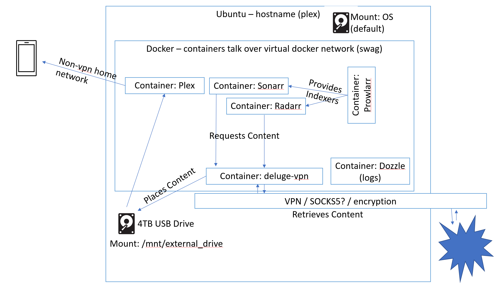

# media_server_stack

- Disclaimer - This content is for educational purposes only!!
- Disclaimer - I'm not an expert but a well-rounded IT Engineer/Developer/Architect/Management for many years. This is my best attempt but may have flaws that need correcting. Please follow the receipe at your own risk OR let me know the flaw and I will do my best to fix it.

# Why

I personally like EIL5 explainations of technology / Just In Time knowledge. I'm not looking on how to be an expert on the topic just gain a little bit of knowledge. My hope to have a media server as a fun side project to learn a bit of docker ended up taking way to long to do. Most guides were either very deep, assumed you already had background knowledge, or wanted you to watch a video that was too long for my attention span/availability due to life.

# Topics / Keywords - I wish I knew about before starting down this path
* Hardware - Synology NAS - It seems a lot of people like this brand NAS + unRaid + docker for the solution.
* Software - There is an OS called unraid (https://unraid.net/) which seems to be very popular for media servers.
* Knowledge - This Guide here provides a bunch of information: 
  * https://trash-guides.info/Hardlinks/How-to-setup-for/Unraid/
* Knowledge - https://geek-cookbook.funkypenguin.co.nz/recipes/autopirate/
* Helpful Software - Visual Studio Code on Linux - More than a text editor
  * https://code.visualstudio.com/docs/setup/linux
=======
>>>>>>> ad0ad1ef761f583075a6c5670efa74f9af63369b

- Hardware - Synology Nas - It seems a lot of people like this brand NAS + unRaid + docker for the solution.
- Software - There is an OS called unraid (https://unraid.net/) which seems to be very popular for media servers.
- Knowledge - This Guide here provides a bunch of information:
  - https://trash-guides.info/Hardlinks/How-to-setup-for/Unraid/
- Knowledge - https://geek-cookbook.funkypenguin.co.nz/recipes/autopirate/

# Software Used

- https://sonarr.tv/ - TV Management
- https://radarr.video/ - Movie Management
- https://wiki.servarr.com/prowlarr - Indexer Management
  - \*\* An indexer is a
- https://www.plex.tv/ - media player
- delige-vpn - Bittorrent client with VPN support

# Design



# Prerequisites

- Ubuntu OS
- A variety of legally obtained videos/TV shows which you have purchased or created yourself.
- Enough hard disk space to host your videos/shows

# High Level Steps

## 1. Install the OS

## 2. Configure the OS

### **2a. Mount the external hard drive**

- (edit fstab) _fstab = File System TABle_

### **2b. hardlink vs softlink**

- I didn't do this but it means to point to the actual file and not make many copies of the same thing.

### **2c. Security - Decisions Points**

- 1 USER setup (ROOT) - Run everything as root - easier but not a good idea at all.
- 2 USERS setup (root + < default ubuntu user >) - This is what I did
  - Docker runs as ROOT
  - The docker containers run as < default ubuntu user >
- 3 Each container runs as its own user and has minimal rights. (Least Rights Model)
  * Cybersecurity pure and ideal.
  * This server only contains videos. I don't need this much safety.
  * I set up my ubuntu instance as a DMZ server and has nothing signed in or associated to this server.
### **2d. Filesystem Folder Structure**
  * OS Harddrive
  * External USB Drive (**PERMISSIONS ON FOLDERS IS KEY**)
    * *Enhancement - content isn't moving correctly from completed to folders*
    * This is getting closer to ideal folder structure according to guides
    ```
    hard drive(os)
    
    
    hard drive (/mnt/external_drive)
    |- completed
    |- incomplete
    |- media
       |- movies
       |- tv
       |- holiday_movies 
    |- usenet (not using usenet. This is stubbed out.)
       |- movies
       |- tv
       |- holiday_movies 
    |- torrent
       |- movies
       |- tv
       |- holiday_movies
    ```

### 3. Install Docker
  [Docker Instrucitons](https://docs.docker.com/engine/install/ubuntu/)

### 4. Modify the .env file
- This is most of the work
### 5. Modify the docker-compose.yml file
  - Cybersecurity pure and ideal.
  - This server only contains videos. I don't need this much safety.
  - I set up my ubuntu instance as a DMZ server and has nothing signed in or associated to this server.

## 3. Install Docker

## 4. Modify the .env file

- This is most of the work

## 5. Modify the docker-compose.yml file

- The VPN settings will need to be changed.
  - _Enhancement - The docker-compose.yml should be idempotent_

# Detailed Steps / Important Notes / Concepts

# Useful Docker commands

docker commands
sudo docker-compose up -d

./run_tests

sudo docker-compose down

nosuid,nodev,nofail,x-gvfs-show,rw,exec

sudo docker inspect -f '{{range.NetworkSettings.Networks}}{{.IPAddress}}{{end}}' media-server-stack_sonarr

sudo docker inspect -f '{{range.NetworkSettings.Networks}}{{.IPAddress}}{{end}}' media-server-stack_prowlarr

http://<ip address>:9696
http://localhost:8989

docker-compose up --force-recreate

http://haugene.github.io/docker-transmission-openvpn/faq/#how_do_i_verify_that_my_traffic_is_using_vpn

How do I verify that my traffic is using VPN¶

There are many ways of doing this, and I welcome you to add to this list if you have any suggestions.

You can exec into the container and through the shell use curl to ask for your public IP. There are multiple endpoints for this but here are a few suggestions:
curl http://ipinfo.io/ip
curl http://ipecho.net/plain
curl icanhazip.com

Or you could use a test torrent service to download a torrent file and then you can get the IP from that tracker.
http://ipmagnet.services.cbcdn.com/
https://torguard.net/checkmytorrentipaddress.php

---

---

sudo docker exec -it docker_transmission-openvpn_1 /bin/bash
sudo docker exec -it deluge-vpn /bin/bash

---

\*IP ADDRESSESS

---

It is a virtual network so you need to look up the ips.
localhost does not work

sudo docker ps
-- get the CONTAINER ID
sudo docker inspect <CONTAINER ID>
-- get the ip address

Or you could use a test torrent service to download a torrent file and then you can get the IP from that tracker.
http://ipmagnet.services.cbcdn.com/
https://torguard.net/checkmytorrentipaddress.php

---

---

sudo docker exec -it docker_transmission-openvpn_1 /bin/bash
sudo docker exec -it deluge-vpn /bin/bash

---

\*IP ADDRESSESS

---

It is a virtual network so you need to look up the ips.
localhost does not work

sudo docker ps
-- get the CONTAINER ID
sudo docker inspect <CONTAINER ID>
-- get the ip address

root@plex:/home/waffles/docker# ip address
